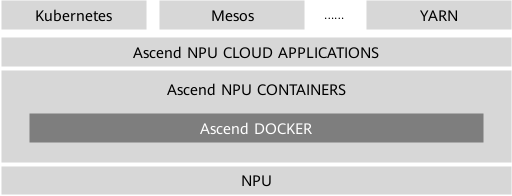
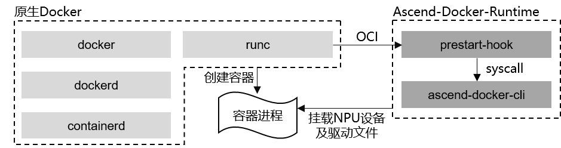

 # 简介
容器引擎插件（Ascend Docker，又叫昇腾容器）是CANN的基础组件，为所有的AI训练/推理作业提供Ascend NPU（昇腾处理器）容器化支持，使用户AI作业能够以Docker容器的方式平滑运行在昇腾设备之上，如图1-1所示。

图1-1 Ascend Docker


## Ascend Docker价值
- 充分解耦：与Docker解耦，无需修改Docker代码，Runtime可以独立演进。
- 后向兼容：提供可选装的Runtime，不影响原生Docker使用方式。
- 易适配：与客户现有平台和系统平滑适配，不影响原Docker的命令接口。
- 易部署：提供run包部署，用户安装后即可用Docker创建挂载Ascend NPU的容器。

## Ascend Docker设计简介
Ascend Docker本质上是基于OCI标准实现的Docker Runtime，不修改Docker引擎，对Docker以插件方式提供Ascend NPU适配功能。
如图1-2所示，Ascend Docker通过OCI接口与原生Docker对接。在原生Docker的runc启动容器过程中，会调用prestart-hook对容器进行配置管理。

图1-2 Docker适配原理



其中，prestart-hook是OCI定义的容器生存状态，即created状态到running状态的一个中间过渡所设置的钩子函数。在这个过渡状态，容器的namespace已经被创建，但容器的作业还没有启动，因此可以对容器进行设备挂载，cgroup配置等操作。这样随后启动的作业便可以使用到这些配置。
Ascend Docker在prestart-hook这个钩子函数中，对容器做了以下配置操作：
1.根据ASCEND_VISIBLE_DEVICES，将对应的NPU设备挂载到容器的namespace。
2.在Host上配置该容器的device cgroup，确保该容器只可以使用指定的NPU，保证设备的隔离。
3.将Host上的CANN Runtime Library挂载到容器的namespace。

***
# 安装、使用和卸载
*注意：目前Ascend Docker Runtime只支持root用户安装Ascend Docker Runtime*
## 安装前准备

* 安装大于18.03版本的docker，请进入[安装详情](https://mirrors.tuna.tsinghua.edu.cn/help/docker-ce/)。
* 宿主机已安装驱动和固件，详情请参见[《CANN 软件安装指南 (开发&运行场景, 通过命令行方式)》](https://support.huawei.com/enterprise/zh/doc/EDOC1100180788?idPath=23710424|251366513|22892968|251168373) 的“准备硬件环境”章节。

## 安装步骤
### 下载源码
```shell
# 下载Ascend Docker Runtime源码
git clone https://gitee.com/ascend/ascend-docker-runtime.git
# 下载安全函数库
cd ascend-docker-runtime/platform
git clone https://gitee.com/openeuler/libboundscheck.git
# 下载makeself
cd ../opensource
git clone https://gitee.com/src-openeuler/makeself.git
tar -zxvf makeself/makeself-2.4.2.tar.gz
```

### 编译
```shell
cd ../build
# 编译
bash build.sh
```

### 安装
```shell
cd ../output
chmod +x Ascend-docker-runtime_{version}_linux-{arch}.run
./Ascend-docker-runtime_{version}_linux-{arch}.run --install
```

### 安装成功后需要运行以下命令让Ascend Docker Runtime生效
```shell
systemctl daemon-reload && systemctl restart docker
```

### 组件状态确认
安装完成之后，验证Ascend Docker Runtime是否安装成功，可执行如下步骤:
* 安装Ascend-docker-runtime后，配置文件“/etc/docker/daemon.json”中的内容会被修改，其中"default-runtime"与"runtimes"字段如下所示:
```json
{
  "default-runtime": "ascend",
  ...
  "runtimes": {
    "ascend": {
      "path": "/usr/local/Ascend/Ascend-Docker-Runtime/ascend-docker-runtime",
      "runtimeArgs": []
    }
  }
}
```
* 执行docker info查看默认Runtime是否为ascend，若是则表示Ascend Docker Runtime安装成功，示例如下:
```shell
$docker info
...
Runtimes: ascend runc
Default Runtime: ascend
...
```
***
### 说明
```text
· Atlas 200 AI加速模块（RC场景）、Atlas 200I SoC A1核心板和Atlas 500 智能小站支持Ascend-Docker-Runtime工具

  安装时需指定--install-type=<type>用于设置Ascend-Docker-Runtime的默认挂载：

    Atlas 200 AI加速模块（RC场景）安装时执行如下命令：

    ./Ascend-docker-runtime_{version}_linux-{arch}.run --install --install-type=A200

    Atlas 200I SoC A1核心板安装时执行如下命令：
    
    ./Ascend-docker-runtime_{version}_linux-{arch}.run --install --install-type=A200ISoC
    
    Atlas 500 智能小站安装时执行如下命令：
    
    ./Ascend-docker-runtime_{version}_linux-{arch}.run --install --whitelist=docker-runtime --install-type=A500

· 如果以root用户安装，建议不要安装在非root用户目录下，否则存在被非root用户替换root用户文件以达到提权目的的安全风险。

· 如果用户指定路径安装时，请确认指定路径符合所在组织的安全要求。

· 如果用户未指定安装路径，则软件会安装到默认路径下，默认安装路径为：/usr/local/Ascend
```
***

## 使用
### 在Docker客户端使用
* 示例1：启动容器时，挂载物理芯片ID为0的芯片。
```shell
docker run -it -e ASCEND_VISIBLE_DEVICES=0 image-name:tag /bin/bash
```
* 示例2：启动容器时，仅挂载NPU设备和管理设备，不挂载驱动相关目录。
```shell
docker run --rm -it -e ASCEND_VISIBLE_DEVICES=0 -e ASCEND_RUNTIME_OPTIONS=NODRV image-name:tag /bin/bash
```
* 示例3：启动容器时，挂载物理芯片ID为0的芯片，读取自定义配置文件hostlog中的挂载内容。
```shell 
run --rm -it -e ASCEND_VISIBLE_DEVICES=0 -e ASCEND_RUNTIME_MOUNTS=hostlog image-name:tag /bin/bash
```
* 示例4：启动容器时，挂载虚拟芯片ID为100的芯片。
```shell
docker run -it -e ASCEND_VISIBLE_DEVICES=100 -e ASCEND_RUNTIME_OPTIONS=VIRTUAL image-name:tag /bin/bash
```
* 示例5：启动容器时，从物理芯片ID为0的芯片上，切分出4个AI Core作为虚拟设备并挂载至容器中。
```shell 
docker run -it --rm -e ASCEND_VISIBLE_DEVICES=0 -e ASCEND_VNPU_SPECS=vir04 image-name:tag /bin/bash
```
容器启动后，可使用
*ls /dev | grep davinci\* && ls /dev | grep devmm_svm && ls /dev | grep hisi_hdc && ls /usr/local/Ascend/driver && ls /usr/local/ |grep dcmi && ls /usr/local/bin*
命令来检查相应设备和驱动是否挂载成功，每台机型具体的挂载目录参考Ascend Docker Runtime[默认挂载内容](##"默认挂载内容")。如下所示（具体内容因机型而异）：
```shell
root@ee30eeda9058:/# ls /dev | grep davinci* && ls /dev | grep devmm_svm && ls /dev | grep hisi_hdc && ls /usr/local/Ascend/driver && ls /usr/local/ |grep dcmi && ls /usr/local/bin
davinci0
davinci1
davinci2
davinci4
davinci_manager
devmm_svm
hisi_hdc
include  lib64
dcmi
npu-smi
```

## 默认挂载内容

### Atlas 200 AI加速模块 RC场景
|              挂载项               |           备注            |
|:------------------------------:|:-----------------------:|
|         /dev/davinciX          | NPU设备，X是ID号，例如，davinci0 |
|      /dev/davinci_manager      |          管理设备           |
| /usr/local/Ascend/driver/tools |       目录，驱动提供的工具包       |
| /usr/local/Ascend/driver/lib64 |      目录，驱动提供的用户态库       |
|    /usr/local/sbin/npu-smi     |      文件，npu-smi工具       |
|       /etc/hdcBasic.cfg        |       文件，hdc基础文件        |
|     /etc/sys_version.conf      |       文件，驱动的版本信息        |


### Atlas 200I SoC A1核心板
|                       挂载项                        |            备注             |
|:------------------------------------------------:|:-------------------------:|
|                  /dev/davinciX                   |  NPU设备，X是ID号，例如，davinci0  |
|               /dev/davinci_manager               |           管理设备            |
|              /usr/local/bin/npu-smi              |       文件，npu-smi工具        |
|                /etc/hdcBasic.cfg                 |        文件，hdc基础文件         |
|              /etc/sys_version.conf               |        文件，驱动的版本信息         |

### Atlas 500 智能小站
|              挂载项              |           备注            |
|:-----------------------------:|:-----------------------:|
|         /dev/davinciX         | NPU设备，X是ID号，例如，davinci0 |
|     /dev/davinci_manager      |          管理设备           |
|         /dev/hisi_hdc         |          管理设备           |
|        /dev/devmm_svm         |          管理设备           |
| /home/data/miniD/driver/lib64 |      目录，驱动提供的用户态库       |
|   /usr/local/lib/libdcmi.so   |       文件，DCMI的动态库       |
|    /usr/local/bin/npu-smi     |      文件，npu-smi工具       |

### 其他设备
|                挂载项                |           备注            |
|:---------------------------------:|:-----------------------:|
|           /dev/davinciX           | NPU设备，X是ID号，例如，davinci0 |
|       /dev/davinci_manager        |          管理设备           |
|           /dev/hisi_hdc           |          管理设备           |
|          /dev/devmm_svm           |          管理设备           |
|   /home/data/miniD/driver/lib64   |      目录，驱动提供的用户态库       |
| /usr/local/Ascend/driver/include  |       目录，驱动提供的头文件       |
|          /usr/local/dcmi          |      目录，DCMI头文件和库       |
|      /usr/local/bin/npu-smi       |      文件，npu-smi工具       |


## 卸载

当不需要使用Ascend Docker Runtime时，可使用如下两种方法进行卸载
***
方法一：软件包卸载
* 首先进入安装包（run包）所在路径
```shell
cd <path to run package>
```
* 用户可通过以下命令卸载Ascend Docker Runtime
```shell
./Ascend-docker-runtime_{version}_linux-{arch}.run --uninstall
```
***
方法二：脚本卸载
* 首先进入Ascend Docker的安装路径下的“script”目录（默认安装路径为：“/usr/local/Ascend/Ascend-Docker-Runtime”）
```shell
cd /usr/local/Ascend/Ascend-Docker-Runtime/script
```
* 运行卸载的脚本进行卸载
```shell
./uninstall.sh
```
*** 
卸载后需要运行以下命令使用默认的runc
```shell
systemctl daemon-reload && systemctl restart docker
```

## 升级

在升级Ascend Docker Runtime时，可执行如下步骤升级
* 安装包下载完成后，首先进入安装包（run包）所在路径。
```shell
cd <path to run package>
```
* 可通过以下命令安装Ascend Docker Runtime。
```shell
chmod +x Ascend-docker-runtime_{version}_linux-{arch}.run
./Ascend-docker-runtime_{version}_linux-{arch}.run --upgrade
```
* 安装成功后需要运行以下命令让Ascend Docker Runtime生效。
```shell
systemctl daemon-reload && systemctl restart docker
```

## 版本更新记录
|   版本   | 发布日期 | 修改说明  |
|:------:|:----:|:-----:|
| v3.0.0 | 2023-01-18 | 第一次发布 |
