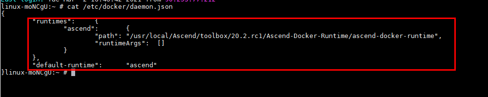
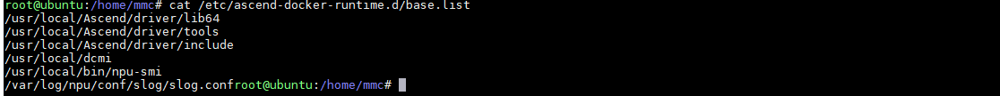
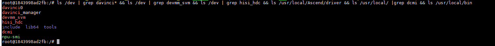
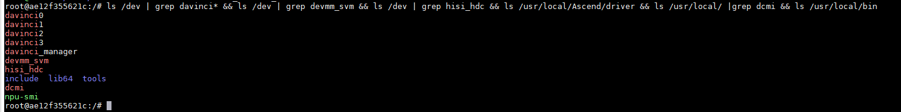
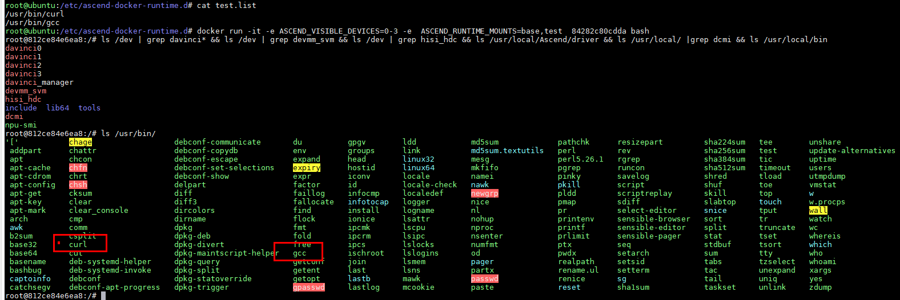
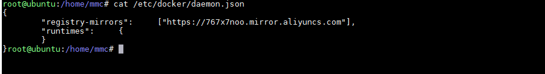

 # 简介
容器引擎插件（Ascend Docker，又叫昇腾容器）是CANN的基础组件，为所有的AI训练/推理作业提供Ascend NPU（昇腾处理器）容器化支持，使用户AI作业能够以Docker容器的方式平滑运行在昇腾设备之上，如图2-1所示。Ascend Docker配套发布的软件包为Ascend-docker-runtime，已集成至实用工具包toolbox中。

图2-1 Ascend Docker


## Ascend Docker价值
- 充分解耦：与Docker解耦，无需修改Docker代码，Runtime可以独立演进。
- 后向兼容：提供可选装的Runtime，不影响原生Docker使用方式。
- 易适配：与客户现有平台和系统平滑适配，不影响原Docker的命令接口。
- 易部署：提供rpm包部署，用户安装后即可用Docker创建挂载Ascend NPU的容器。

## Ascend Docker设计简介
Ascend Docker本质上是基于OCI标准实现的Docker Runtime，不修改Docker引擎，对Docker以插件方式提供Ascend NPU适配功能。
如图2-2所示，Ascend Docker通过OCI接口与原生Docker对接。在原生Docker的runc启动容器过程中，会调用prestart-hook对容器进行配置管理。

图2-2 Docker适配原理


其中，prestart-hook是OCI定义的容器生存状态，即created状态到running状态的一个中间过渡所设置的钩子函数。在这个过渡状态，容器的namespace已经被创建，但容器的作业还没有启动，因此可以对容器进行设备挂载，cgroup配置等操作。这样随后启动的作业便可以使用到这些配置。
Ascend Docker在prestart-hook这个钩子函数中，对容器做了以下配置操作：
1.根据ASCEND_VISIBLE_DEVICES，将对应的NPU设备挂载到容器的namespace。
2.在Host上配置该容器的device cgroup，确保该容器只可以使用指定的NPU，保证设备的隔离。
3.将Host上的CANN Runtime Library挂载到容器的namespace。

# 下载和安装
## 安装前准备

- 安装大于18.03版本的docker，请参考[安装详情](https://mirrors.huaweicloud.com/)

- 宿主机已安装驱动和固件，详情请参见[《CANN 软件安装指南 (开发&运行场景, 通过命令行方式)》](https://support.huawei.com/enterprise/zh/doc/EDOC1100180788?idPath=23710424|251366513|22892968|251168373) 的“准备硬件环境”章节。

## 下载
### run包
开发人员可从昇腾社区下载Toolbox,下载链接为：https://www.hiascend.com/software/mindx-dl/community，
下载后安装Toolbox，Ascend-docker-runtime已集成至实用工具包toolbox中。

# 功能
## 默认挂载内容
### Atlas 200 AI加速模块 RC场景
|              挂载项               |           备注            |
|:------------------------------:|:-----------------------:|
|         /dev/davinciX          | NPU设备，X是ID号，例如，davinci0 |
|      /dev/davinci_manager      |          管理设备           |
| /usr/local/Ascend/driver/tools |       目录，驱动提供的工具包       |
| /usr/local/Ascend/driver/lib64 |      目录，驱动提供的用户态库       |
|    /usr/local/sbin/npu-smi     |      文件，npu-smi工具       |
|       /etc/hdcBasic.cfg        |       文件，hdc基础文件        |
|     /etc/sys_version.conf      |       文件，驱动的版本信息        |


### Atlas 200I SoC A1核心板
|                       挂载项                        |            备注             |
|:------------------------------------------------:|:-------------------------:|
|                  /dev/davinciX                   |  NPU设备，X是ID号，例如，davinci0  |
|               /dev/davinci_manager               |           管理设备            |
|              /usr/local/bin/npu-smi              |       文件，npu-smi工具        |
|                /etc/hdcBasic.cfg                 |        文件，hdc基础文件         |
|              /etc/sys_version.conf               |        文件，驱动的版本信息         |

### Atlas 500 智能小站
|              挂载项              |           备注            |
|:-----------------------------:|:-----------------------:|
|         /dev/davinciX         | NPU设备，X是ID号，例如，davinci0 |
|     /dev/davinci_manager      |          管理设备           |
|         /dev/hisi_hdc         |          管理设备           |
|        /dev/devmm_svm         |          管理设备           |
| /home/data/miniD/driver/lib64 |      目录，驱动提供的用户态库       |
|        /usr/local/dcmi        |      目录，DCMI头文件和库       |
|    /usr/local/bin/npu-smi     |      文件，npu-smi工具       |

### 其他设备
|                挂载项                |           备注            |
|:---------------------------------:|:-----------------------:|
|           /dev/davinciX           | NPU设备，X是ID号，例如，davinci0 |
|       /dev/davinci_manager        |          管理设备           |
|           /dev/hisi_hdc           |          管理设备           |
|          /dev/devmm_svm           |          管理设备           |
|   /home/data/miniD/driver/lib64   |      目录，驱动提供的用户态库       |
| /usr/local/Ascend/driver/include  |       目录，驱动提供的头文件       |
|          /usr/local/dcmi          |      目录，DCMI头文件和库       |
|      /usr/local/bin/npu-smi       |      文件，npu-smi工具       |
## Ascend-Docker-runtime安装
### 单独安装
```shell
chmod +x Ascend-mindx-toolbox_{version}_linux-{arch}.run
./Ascend-mindx-toolbox_{version}_linux-{arch}.run  --install --whitelist=docker-runtime
systemctl daemon-reload
systenctl restart docker
```
### 或者 集成工具toolboox安装
```shell
chmod +x Ascend-mindx-toolbox_{version}_linux-{arch}.run
./Ascend-mindx-toolbox_{version}_linux-{arch}.run  --install
systemctl daemon-reload
systemctl restart docker
```
### 说明
```
· Atlas 200 AI加速模块（RC场景）、Atlas 200I SoC A1核心板和Atlas 500 智能小站支持Ascend-Docker-Runtime工具

  安装时需指定--install-type=<type>用于设置Ascend-Docker-Runtime的默认挂载：

    Atlas 200 AI加速模块（RC场景）安装时执行如下命令：

    ./Ascend-mindx-toolbox_{version}_linux-{arch}.run --install --install-type=A200

    Atlas 200I SoC A1核心板安装时执行如下命令：
    
    ./Ascend-mindx-toolbox_{version}_linux-{arch}.run --install --install-type=A200ISoC
    
    Atlas 500 智能小站安装时执行如下命令：
    
    ./Ascend-mindx-toolbox_{version}_linux-{arch}.run --install --whitelist=docker-runtime --install-type=A500

· 如果以root用户安装，建议不要安装在非root用户目录下，否则存在被非root用户替换root用户文件以达到提权目的的安全风险。

· 如果用户指定路径安装时，请确认指定路径符合所在组织的安全要求。

· 如果用户未指定安装路径，则软件会安装到默认路径下，默认安装路径如下：

   root用户：“/usr/local/Ascend”
   
   非root用户：“${HOME}/Ascend”

   其中${HOME}为当前用户目录。
```

安装docker-runtime后会修改配置文件/etc/docker/daemon.json



同时自动生成默认挂载目录文件/etc/ascend-docker-runtime.d/base.list



## 挂载单芯片
例子：
```shell
docker run -it -e ASCEND_VISIBLE_DEVICES=0 imageId /bin/bash
```
imageId 替换为实际镜像名或者ID

检查挂载成功：
```shell
ls /dev | grep davinci* && ls /dev | grep devmm_svm && ls /dev | grep hisi_hdc && ls /usr/local/Ascend/driver && ls /usr/local/ |grep dcmi && ls /usr/local/bin
```


ASCEND_VISIBLE_DEVICES=0，参数0替换为要挂载的芯片物理ID
## 挂载多芯片
例子：
```shell
docker run --rm -it -e ASCEND_VISIBLE_DEVICES=0-3 imageId /bin/bash
或者
docker run --rm -it -e ASCEND_VISIBLE_DEVICES=0,1,2,3 imageId /bin/bash
或者
docker run --rm -it -e ASCEND_VISIBLE_DEVICES=0-2,3 imageId /bin/bash
```
检查挂载成功：
```shell
ls /dev | grep davinci* && ls /dev | grep devmm_svm && ls /dev | grep hisi_hdc && ls /usr/local/Ascend/driver && ls /usr/local/ |grep dcmi && ls /usr/local/bin
```

## 挂载虚拟芯片
```shell
docker run -it -e ASCEND_VISIBLE_DEVICES=100 -e ASCEND_RUNTIME_OPTIONS=VIRTUAL imageId /bin/bash
```
该命令会挂载虚拟芯片ID为100的芯片
## 切分AI Core
```shell
docker run -it --rm -e ASCEND_VISIBLE_DEVICES=0 -e ASCEND_VNPU_SPECS=vir04 imageId /bin/bash
```
该命令表示，启动容器时，从物理芯片ID为0的芯片上，切分出4个AI Core作为虚拟设备并挂载至容器中。
## 在默认的挂载的基础上新增挂载内容
```
在/etc/ascend-docker-runtime.d目录下新建挂载文件xxx.list，内容格式例子：
/usr/bin/curl
/usr/bin/gcc
...

在命令中使用文件例子：
docker run --rm -it -e ASCEND_VISIBLE_DEVICES=0 -e ASCEND_RUNTIME_MOUNTS=xxx imageId /bin/bash
```
xxx是新增挂载内容文件名，文件名必须是小写

检查挂载成功：



启动容器时docker客户端会根据/etc/docker/daemon.json配置文件调用docker-runtime，容器正常启动时修改
/proc/当前进程id/cgroup 资源隔离文件
## 卸载

集成工具toolboox卸载
```shell
./Ascend-mindx-toolbox_{version}_linux-{arch}.run --uninstall
```
卸载docker-runtime后会自动删除安装时配置文件/etc/docker/daemon.json中新增的内



同时删除默认挂载目录文件/etc/ascend-docker-runtime.d/base.list
## 升级

集成工具toolboox安装方式升级
```shell
./Ascend-mindx-toolbox_{version}_linux-{arch}.run --upgrade
```

